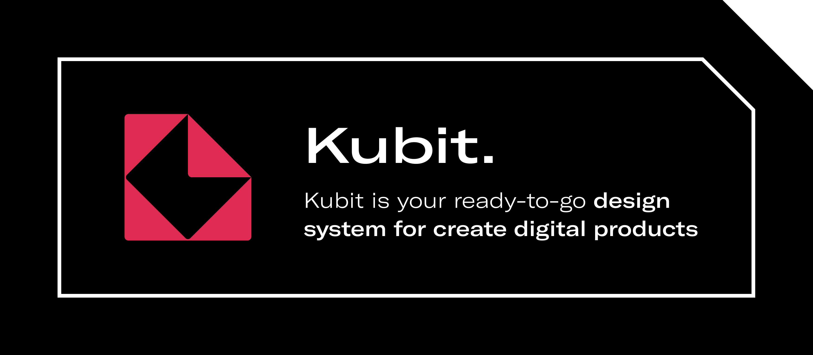

<p align="center">
  <a href="https://kubit-ui.com">
    <picture>
      <source media="(prefers-color-scheme: dark)" srcset="./assets/banner_kubit_readme.png">
      
    </picture>
  </a>
</p>

<div align='center'>
  
<a href='#'>

</a>
  
<a href='#'>

</a>
  
</div>

<br />

---

<br />

# Getting Started

## Installation

To install the package, run the following command:

### npm

```bash
npm install @kubit-ui-web/react-components
```

### yarn

```bash
yarn add @kubit-ui-web/react-components
```

This will install the package and its dependencies. Now you can import the components and use them in your application.

## Usage

To use the components, import them from the package and use them in your application.

```tsx
import { Button, KubitProvider } from '@kubit-ui-web/react-components';
import React from 'react';

const App = () => {
  return (
    <KubitProvider>
      <Button variant="PRIMARY" size="MEDIUM">
        Click me
      </Button>
    </KubitProvider>
  );
};

export default App;
```

This will render the button with the default styles and functionality.

> Note: The `KubitProvider` is required to use the components. It provides the theme and other context to the components.

You can foud more information about change the theme and other options in the [Customize theme](https://kubit-ui.com)

## Documentation

You can find the documentation for the web components in the [Kubit UI website](https://kubit-ui.com)

## Storybook

To run the storybook, first of all clone the repository and install the dependencies. Then run the following command:

```bash
npm run storybook

yarn storybook
```

This will start the storybook server and you can see the components in action.

## Tests

To run the tests, you can use the following command:

```bash
npm run test

yarn test
```

This will run the tests and show the results in the terminal.

## Contributing

We are open to contributions. If you want to contribute to the project, please follow the steps below:

1. **Fork the Repository**: Click the "Fork" button in the upper right corner of the repository's page on GitHub. This will create a copy of the repository in your account.

2. **Clone the Repository**: Use `git clone` to clone the repository to your local machine.

   ```sh
   git clone
   ```

3. **Create a Branch**: Use `git checkout` to create a new branch for your changes.

   ```sh
   git checkout -b <branch-name>
   ```

4. **Make Changes**: Make any necessary changes to the codebase. And **test** the changes.

5. **Commit Changes**: Use `git commit` to commit your changes to the branch.

   ```sh
   git commit -m "Your commit message"
   ```

6. **Push Changes**: Use `git push` to push your changes to your forked repository.

   ```sh
   git push origin <branch-name>
   ```

7. **Open a Pull Request**: Go to the original repository on GitHub and click the "New pull request" button. Fill out the form with details about your changes and submit the pull request.

Once your pull request has been submitted, a maintainer will review your changes and provide feedback. If everything looks good, your pull request will be merged and your changes will become part of the project.

For more information on contributing to our projects, please refer to the `CONTRIBUTING.md` file.
