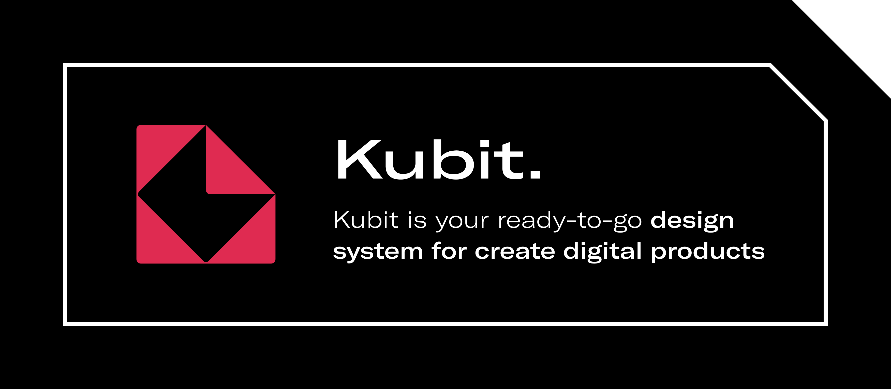

<p align="center">
  <a href="https://kubit-ui.com">
    <picture>
      <source media="(prefers-color-scheme: dark)" srcset="./public/assets/banner_kubit_readme.png">
      
    </picture>
  </a>
</p>

<div align="center">

[](https://www.npmjs.com/package/@kubit-ui-web/react-components)
[](https://www.npmjs.com/package/@kubit-ui-web/react-components)
[](https://bundlephobia.com/package/@kubit-ui-web/react-components)

[](./LICENSE.md)
[](https://github.com/kubit-ui/kubit-react-components/stargazers)
[](https://github.com/kubit-ui/kubit-react-components/issues)

[](https://www.typescriptlang.org/)
[](https://reactjs.org/)
[](https://storybook.js.org/)

</div>

<br />

---

<br />

# Getting Started

> **Kubit React Components** is a customizable, accessible library of React web components, designed to enhance your application's user experience with production-ready components.

## 📋 Table of Contents

- [Installation](#installation)
- [Quick Start](#quick-start)
- [Usage](#usage)
- [Documentation](#documentation)
- [Storybook](#storybook)
- [Features](#features)
- [Browser Support](#browser-support)
- [Contributing](#contributing)
- [License](#license)

## Installation

Install the package using your preferred package manager:

### npm

```bash
npm install @kubit-ui-web/react-components
```

### yarn

```bash
yarn add @kubit-ui-web/react-components
```

### pnpm

```bash
pnpm add @kubit-ui-web/react-components
```

**Package Info:**

- 📦 Size: ~235 KB (gzipped)
- 🎯 Tree-shakeable: Yes
- 📘 TypeScript: Full support
- ⚛️ React: 17+ and 18+

## Quick Start

Import and use components in your application:

## Quick Start

Import and use components in your application:

```tsx
import React from 'react';

import { Button, KubitProvider } from '@kubit-ui-web/react-components';
import '@kubit-ui-web/react-components/styles/default/default.min.css';

const App = () => {
  return (
    <KubitProvider>
      <Button variant="PRIMARY" size="MEDIUM">
        Click me
      </Button>
    </KubitProvider>
  );
};

export default App;
```

> **Note:** The `KubitProvider` is required to use the components. It provides the theme and other context.

## Usage

### Basic Components

```tsx
import {
  Button,
  Input,
  KubitProvider,
  Modal,
  Tooltip,
} from '@kubit-ui-web/react-components';

function MyApp() {
  return (
    <KubitProvider>
      <Input label="Email" placeholder="Enter your email" type="email" />

      <Button variant="PRIMARY" onClick={handleClick}>
        Submit
      </Button>

      <Tooltip content="Helpful information">
        <span>Hover me</span>
      </Tooltip>
    </KubitProvider>
  );
}
```

### Custom Theme

Customize the theme to match your brand:

```tsx
import { KubitProvider } from '@kubit-ui-web/react-components';

const customTheme = {
  colors: {
    primary: '#your-color',
    secondary: '#your-secondary',
  },
};

function App() {
  return (
    <KubitProvider theme={customTheme}>{/* Your components */}</KubitProvider>
  );
}
```

For more information about theme customization, visit [Kubit UI Documentation](https://kubit-ui.com).

## Features

✨ **50+ Production-Ready Components**

- Buttons, Inputs, Modals, Tooltips, and more
- Fully customizable and themeable

♿ **Accessible by Default**

- WCAG 2.1 AA compliant
- Keyboard navigation support
- Screen reader friendly

🎨 **Design System Integration**

- Built with design tokens
- CSS variables for easy customization
- Bernova CSS generation

📦 **Developer Experience**

- Full TypeScript support
- Tree-shakeable exports
- Comprehensive documentation
- Rich Storybook examples

🚀 **Performance Optimized**

- Small bundle size (~235 KB gzipped)
- Code splitting ready
- Minimal runtime overhead

## Browser Support

| Browser | Version         |
| ------- | --------------- |
| Chrome  | Last 2 versions |
| Firefox | Last 2 versions |
| Safari  | Last 2 versions |
| Edge    | Last 2 versions |

## Documentation

You can find comprehensive documentation for all components at:

🌐 **[Kubit UI Website](https://kubit-ui.com)**

- Component API documentation
- Interactive examples
- Design guidelines
- Migration guides

## Storybook

Explore all components interactively in Storybook.

### View Online

🎭 **[View Storybook](https://kubit-ui.com/storybook)** - Browse all components online

### Run Locally

To run Storybook locally:

1. Clone the repository:

   ```bash
   git clone https://github.com/kubit-ui/kubit-react-components.git
   cd kubit-react-components
   ```

2. Install dependencies:

   ```bash
   npm install
   # or
   yarn install
   ```

3. Start Storybook:
   ```bash
   npm run storybook
   # or
   yarn storybook
   ```

This will start the Storybook server at `http://localhost:6006` where you can see all components in action.

## Tests

Run the test suite to ensure everything works correctly:

```bash
# Run all tests
npm run test
# or
yarn test

# Watch mode (for development)
npm run test:watch
# or
yarn test:watch

# Coverage report
npm run test:coverage
# or
yarn test:coverage
```

**Test Stack:**

- ✅ Vitest - Fast unit testing
- 🧪 Testing Library - Component testing
- ♿ vitest-axe - Accessibility testing

## Contributing

We welcome contributions from the community! Here's how you can help:

### Ways to Contribute

- 🐛 Report bugs
- 💡 Suggest new features
- 📝 Improve documentation
- 🔧 Submit pull requests
- ⭐ Star the repository

### Contribution Steps

1. **Fork the Repository**: Click the "Fork" button in the upper right corner of the [repository's page](https://github.com/kubit-ui/kubit-react-components) on GitHub.

2. **Clone the Repository**: Clone your fork to your local machine.

   ```bash
   git clone https://github.com/YOUR_USERNAME/kubit-react-components.git
   cd kubit-react-components
   ```

3. **Create a Branch**: Create a new branch for your changes.

   ```bash
   git checkout -b feature/your-feature-name
   ```

4. **Install Dependencies**:

   ```bash
   yarn install
   ```

5. **Make Changes**: Make your changes and test them thoroughly.

   ```bash
   yarn test
   yarn lint
   yarn typecheck
   ```

6. **Commit Changes**: Use conventional commits for your messages.

   ```bash
   git commit -m "feat: add new component feature"
   ```

   **Commit Types:**
   - `feat:` - New feature
   - `fix:` - Bug fix
   - `docs:` - Documentation changes
   - `style:` - Code style changes (formatting)
   - `refactor:` - Code refactoring
   - `test:` - Adding or updating tests
   - `chore:` - Maintenance tasks

7. **Push Changes**: Push your changes to your fork.

   ```bash
   git push origin feature/your-feature-name
   ```

8. **Open a Pull Request**: Go to the original repository and click "New pull request". Fill out the PR template with details about your changes.

### Development Commands

```bash
# Start development server
yarn dev

# Run Storybook
yarn storybook

# Build library
yarn dist

# Run tests
yarn test

# Lint code
yarn lint

# Type check
yarn typecheck

# Check package size
yarn pack:size
```

For more detailed information, please refer to the [CONTRIBUTING.md](./CONTRIBUTING.md) file.

## Community & Support

- 💬 [GitHub Discussions](https://github.com/kubit-ui/kubit-react-components/discussions) - Ask questions and share ideas
- 🐛 [Issue Tracker](https://github.com/kubit-ui/kubit-react-components/issues) - Report bugs and request features
- 📧 [Email](mailto:kubit@opendigitalservices.com) - Contact the team
- 🐦 [Twitter](https://twitter.com/kubit_ui) - Follow for updates

## Related Projects

- [Kubit Design System](https://kubit-ui.com) - Complete design system documentation
- [Kubit Figma Kit](https://figma.com/@kubit) - Design files and components

## Changelog

See [CHANGELOG.md](./CHANGELOG.md) for a list of changes and migration guides.

## Migration Guides

- [v1.x to v2.0.0](./MIGRATION_GUIDE.md) - Complete migration guide for major version

## License

This project is licensed under the **Apache License 2.0** - see the [LICENSE.md](./LICENSE.md) file for details.

```
Copyright 2025 Kubit

Licensed under the Apache License, Version 2.0 (the "License");
you may not use this file except in compliance with the License.
You may obtain a copy of the License at

    http://www.apache.org/licenses/LICENSE-2.0
```

---

<div align="center">

**Made with ❤️ by the Kubit Team**

[](https://github.com/kubit-ui/kubit-react-components)
[](https://www.npmjs.com/package/@kubit-ui-web/react-components)
[](https://kubit-ui.com)

If you find this project useful, please consider giving it a ⭐️!

</div>
